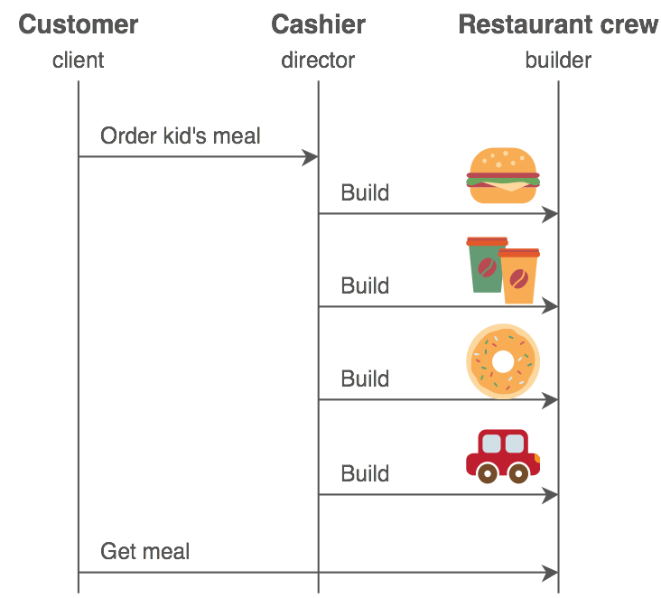

<h1 align="center">Design Pattern in Programming 
    Everything you had better know about design pattern
</h1>

    

# [**Table Of Content**](#table-of-content)
- [**Table Of Content**](#table-of-content)
- [**What is Design Pattern ?**](#what-is-design-pattern-)
- [**Why shall we use Design Pattern ?**](#why-shall-we-use-design-pattern-)
- [**When shall we take advance of Design Pattern ?**](#when-shall-we-take-advance-of-design-pattern-)
- [**What you need to prepare before learning Design pattern ?**](#what-you-need-to-prepare-before-learning-design-pattern-)
- [**Types of design pattern**](#types-of-design-pattern)
  - [**Creational**](#creational)
    - [**Creational - Factory Method**](#creational---factory-method)
    - [**Creational - Abstract Method**](#creational---abstract-method)
    - [**Creational - Singleton**](#creational---singleton)
    - [**Creational - Builder**](#creational---builder)
    - [**Creational - Prototype**](#creational---prototype)
  - [**Structural**](#structural)
    - [**Structural - Adapter**](#structural---adapter)
    - [**Structural - Composite**](#structural---composite)
    - [**Structural - Bridge**](#structural---bridge)
    - [**Structural - Decorator**](#structural---decorator)
    - [**Structural - Facade**](#structural---facade)
    - [**Structural - Flyweight**](#structural---flyweight)
    - [**Structural - Proxy**](#structural---proxy)
  - [**Behavioural**](#behavioural)
    - [**Behavioural - Chain of responsibility**](#behavioural---chain-of-responsibility)
    - [**Behavioural - Command**](#behavioural---command)
    - [**Behavioural - Iterator**](#behavioural---iterator)
    - [**Behavioural - Mediator**](#behavioural---mediator)
    - [**Behavioural - Memento**](#behavioural---memento)
    - [**Behavioural - Observer**](#behavioural---observer)
    - [**Behavioural - State**](#behavioural---state)
    - [**Behavioural - Strategy**](#behavioural---strategy)
    - [**Behavioural - Template Method**](#behavioural---template-method)
    - [**Behavioural - Visitor**](#behavioural---visitor)
    - [**Behavioural - Interpreter**](#behavioural---interpreter)
- [**Another Specific Terms**](#another-specific-terms)
  - [**What is an abstract class ?**](#what-is-an-abstract-class-)
  - [**What is a concrete class ?**](#what-is-a-concrete-class-)
- [**My Mentors**](#my-mentors)
- [**Credit**](#credit)
- [**Made with 💘 and English  **](#made-with--and-english--)

# [**What is Design Pattern ?**](#what-is-design-pattern)
Software development is an iterative process and there are many problems which developers has to face up to many times. Programmers could come up with an idea for addressing the problem yet it isn't the most effective. Design pattern supplies best optimized "samples" (or maybe "patterns") in getting programming with OOP.

Design patterns are the solution for software problems that we copes fluently.

The outstanding thing of design pattern is reusable.

# [**Why shall we use Design Pattern ?**](#why-shall-we-use-design-pattern)

Design patterns can speed up the development process by providing tested, proven development paradigms. Effective software design requires considering issues that may not become visible until later in the implementation. Reusing design patterns helps to prevent subtle issues that can cause major problems and improves code readability for coders and architects familiar with the patterns.

Often, people only understand how to apply certain software design techniques to certain problems. These techniques are difficult to apply to a broader range of problems. Design patterns provide general solutions, documented in a format that doesn't require specifics tied to a particular problem.

In addition, patterns allow developers to communicate using well-known, well understood names for software interactions. Common design patterns can be improved over time, making them more robust than ad-hoc designs.

# [**When shall we take advance of Design Pattern ?**](#when-shall-we-take-advance-of-design-pattern)

If you desires your application more simpler as more as possible. Implementing **Design Pattern** save our time & efforts to figure out solution to problems having correct way to fix.

# [**What you need to prepare before learning Design pattern ?**](#what-you-need-to-prepare-before-learning-design-pattern)

You must understand deeply 4 principles in [**Object-Oriented Programming**](https://www.techtarget.com/searchapparchitecture/definition/object-oriented-programming-OOP)(OOP). They includes: 

1. Inheritance

2. Encapsulation

3. Abstraction

4. Polymorphism

In addition, you have to identify `Interface` & `Abstraction` 

100% thinking by OOP

# [**Types of design pattern**](#types-of-design-pattern)

There are 3 types of design pattern that we usually utilize. They comprise:

- Creational

- Structural

- Behavioural

## [**Creational**](#creational)

    

<h3 align="center">

***CREATIONAL PATTERN INCLUDES 5 SAMPLES***
</h3>

Creational pattern comprise 5 prototypes: 

1. Factory Method

2. Abstract Method

3. Singleton

4. Builder

5. Prototype

Instead of creating an object with `new` method, creational pattern provides a solution to instantiate an object & hide the logical way to create it. This way makes an application more flexible when it determines which objects will be created depend on what situation happens.

These patterns are used for instantiation of classes. They are concerned with the way of creating objects. Normally object creation happens in the below way by using the new keyword.

    Student myStudent = new Student();

The above code is more than enough for object instantiation, but in some cases `the object must be changed according to the nature of the program in runtime`, in such cases, creational design patterns will be useful.

### [**Creational - Factory Method**](#creational---factory-method)

- Fluency of use: ⭐ ⭐ ⭐ ⭐ ⭐ 

[**1. Definition**](#)

Factory Method is a creational design pattern that Define an interface for creating an object, but let subclasses decide which class to instantiate. Factory Method lets a class defer instantiation to subclasses.

Factory Method is a factory explicitly. This "factory" manufactures objects which we need only.

In Factory Method, it consist of 3 basic components:

1. Super Class: a super class could be interface, abstract & normal class.

2. Sub Class: classes which implements all methods from super class according to its own business.

3. Factory Class: a class is in charge of instantiate subclass's objects basing on passed parameters.

>Note: Factory class could be `Singleton` or any class providing a `public static` method for querying or creating an objects. It is said that factory uses `if-else` or `switch-case` so as to decide output subclass.

[**2. Example**](#)

We own a Mobile Money application for mobile device(Momo, Zalo and so forth). There are many financial organizations as ARGIBANK, BIDV, VIETCOMBANK,.... They are able to supply us a restfulAPI to use their services. The point in this scenario is how we don't need to change our core source code to use their restfulAPI if we want to cope with other businesses..... The answer for the problem is taking advantage of `Factory Method`

    

<h3 align="center">

***WE DON'T WANT TO MODIFY / EXTEND CODE FOR EACH BANKS WE INCORPORATE? FACTORY METHOD IS THE KEY TO ADDRESS***
</h3>

First, create super class:

    public interface Bank{

        String getName();
        String getAddress();

        #do what you want
    }

Second, create 2 subclass which implements `Bank` interface 

- TPBank Class:
  
        package com.gpcoder.patterns.creational.factorymethod;
 
        public class TPBank implements Bank {
 
            @Override
            public String getName() {
                return "TPBank - A deeper understanding";
            }
 
            @Override
            public String getAddress()
            {
                return "49 Mac Dinh Chi, District 1, TP.HCM, Vietnam"
            }

            # any method/ functions are able to declare below.
        }

- Vietcombank Class

        package com.gpcoder.patterns.creational.factorymethod;
 
        public class Vietcombank implements Bank {
 
            @Override
            public String getName() {
                return "Vietcombank - Together for the future";
            }

            @Override
            public String getAddress()
            {
                return "125 Oktoberfest, District Deutschland, Berlin, Germany"
            }

            # any method/ functions are able to declare below.
        }

Third, instantiating `enum BankName`, the enum stores constant through our application. To manage easier with our customers, `ENUM` is chosen to store banks name.

        public enum BankName{

            # you can add more bank name if needed
            TPBANK, VIETCOMBANK
            BIDV, AGRIBANK,
            LienVietPostBank;

        }

Fourth, creating Factory Method. In this example, it is called `BankFactory`.

        public class BankFactory {
 

            # Constructor
            private BankFactory() {
            }
        

            # "getBank" method create an instance depending on @parameter BankName
            public static final Bank getBank(BankName bankName) {
                switch (bankName) {
        
                case TPBANK:
                    return new TPBank();
        
                case VIETCOMBANK:
                    return new Vietcombank();

                default:
                    throw new IllegalArgumentException("This bank is unsupported");
                }
            }
        
        }
Final, call `BankFactory` in our application"

    public class Client {
 
        public static void main(String[] args) {

            Bank bank = BankFactory.getBank(BankType.Vietcombank);

            String name = bank.getName();
            String address = bank.getAddress();

            System.out.println("One of our customer is " + content);
            System.out.println("Their headquarter is in " + address);
        }
    }

The output is absolutely as

    One of our customer is Vietcombank - Together for the future

    Their headquarter is in 125 Oktoberfest, District Deutschland, Berlin, Germany

### [**Creational - Abstract Method**](#creational---abstract-method)

- Fluency of use: ⭐ ⭐ ⭐ ⭐ 

[**1. Definition**](#)

Abstract Factory is a creational design pattern that provide an interface for creating families of  related or dependent objects without specifying their concrete classes.

>From my point of view, an Abstract (Factory) Method is a Factory method whose ability is to create a Factory Method.

Abstract Factory is the way to create a Super Factory. A `Super Factory` is eligible for creating a [**Factory Method**](#creational---factory-method)

In other word, Abstract Factory is a higher level of Factory Method. You could assume that Abstract Factory is an enormous factory. The enormous(Abstract Factory) factory comprises a number of small factory. Each small factory(Factory Method) specializes its own business.

A standard Abstract (Factory) Method embraces 5 components:

- **Abstract (Factory) Method** - it is defined `Interface` or `Abstract` class. They consists methods creating Abstract objects. To answer question: What does Abstract Method embrace ?

- **Abstract Product** - it is declared as `Interface` or `Abstract` class so as to define Abstract objects. To answer question: what activity **Abstract (Factory) Method's element** do ?

- **Concrete Factory** - building, instantiating methods which is used to create specific objects. To answer question: What do they need to begin run ?

- **Product** - Install of specific objects & write coding-flow for **Abstract Product's methods**. To answer question: How do they do ?

- **Client** - The objects uses **Abstract Factory** & **Abstract Product**.

[**2. Example**](#)

You are the chairman of GeoComply group - a furniture manufacturer. Your business supplies Table & Chair which is made from Wood or Plastic. However, manufacturing Wood furnitures & Plastic furnitures is 100% different . Therefore, you need 2 different factories to create them. Your customers can make orders which include both wood & plastic furnitures. Both of 2 factories will make process to fulfill your customers's order.   

    

<h3 align="center">

***A BUSINESS HAS 2 FACTORY SPECIALIZED FOR EACH MATERIALS***
</h3>

First, using `ENUM` to store constants:

    public enum  Material{

        # add more types of material if you want
        PLASTIC, WOOD;

    }

Second, declaring **Abstract (Factory) Method**, it will be called Furniture Factory:

    public class FurnitureFactory {
 
        # constructor
        private FurnitureFactory() {
    
        }
    

        public static FurnitureAbstractFactory getFactory(Material material) {
            switch (materialType) 
            {
                case PLASTIC:
                    return new PlasticFactory();

                case WOOD:
                    return new WoodFactory();

                default:
                    throw new UnsupportedOperationException("This material is unsupported ");
            }
        }
    }

Third, creating **Abstract Factory**. This is `Abstract` class which defines what activities that WoodFactory & PlasticFactory do. ManufactureChair() and manufactureTable(), for instance.

    public abstract class FurnitureAbstractFactory{

        public abstract Chair manufactureChair();

        public abstract Table manufactureTable();
    }

>Note: Don't forget to declare `Chair` class & `Table` class into a Model folder.

Fourth, **Concrete Factory** determines what factories need to begin operating

- Plastic Factory:

        public class PlasticFactory extends FurnitureAbstractFactory {

            # what does PlasticFactory need to manufacture a Plastic Chair?
            @Override
            public Chair manufactureChair() {
                return new PlasticChair();
            }
 
            # what does PlasticFactory need to manufacture a Plastic Table?
            @Override
            public Table manufactureTable() {
                return new PlasticTable();
            }
        }

- Wood Factory:

        public class WoodFactory extends FurnitureAbstractFactory {
 
            @Override
            public Chair manufactureChair() {
                return new WoodChair();
            }
 
            @Override
            public Table manufactureTable() {
                return new WoodTable();
            }
        }

Fifth, **Abstract Product** tell us what actions we could do with a `Chair` & `Table`

- Chair:

        public interface Chair(){
            
            void create();
        }
- Table:

        public interface Table(){
            
            void create();
        }
Sixth, Depending on what material is used to make them. We have to write code for each Factory with its own business.

1. Plastic Factory 
- Chair
  
        public class PlasticChair implements Chair{

            @Override
            public void create(){
                System.out.println("Plastic chair is created !");
            }
        }

- Table

         public class PlasticTable implements Table{

            @Override
            public void create(){
                System.out.println("Plastic table is created !");
            }
        }
2. Wood Factory
- Chair
  
        public class WoodChair implements Chair {

            @Override
            public void create() {
                System.out.println("Wood chair is created !");
            }

        }
- Table

        public class WoodTable implements Table{
            @Override
            public void create(){
                System.out.println("Wood table is created !");
            }
        }

Finally, we are able to use **Furniture Factory** as:

        public static void main(String[] args){

            FurnitureAbstractFactory factory = FurnitureFactory.getFactory(MaterialType.WOOD);
 
                Chair chair = factory.manufactureChair();
                chair.create(); 
 
                Table table = factory.manufactureTable();
                table.create();
            }
        }

Output

        Wood chair is created !

        Wood table is created !

### [**Creational - Singleton**](#creational---singleton)

- Fluency of use: ⭐ ⭐ ⭐ ⭐ 

[**1. Definition**](#)

Scenario: Sometimes, in a system analysis, we desire having objects that exist only & could be given access from every where. How can we do this ? Maybe you have idea using a `public static final` variable. However, the use of it absolutely break one of 4 principles of OOP - Encapsulation. To prevent this happening, it's high time we used `Singleton`.

Singleton is a creational design pattern that lets you ensure that a class has only one instance and provide a global access point to this instance.

There are many possible ways to use Singleton yet they have something in common:

- `Private constructor` prevents accessing from other classes.

- `Private static final` variable guarantees it is only defined in its class.

- There is a `public static` method to return its instance from any other classes.

[**2. Implementation**](#)

[**2.1. Singleton - Eager Initialization**](#)

Singleton is created immediately when called. This is the simplest way yet it has a disadvantage that the instance isn't maybe used.

    public class EagerSingleton{
        
        # Private static final variable guarantees it is only defined in its class.
        private static final EagerSingle instance = new EagerSingle();

        # Private constructor prevents accessing from other classes.
        private EagerSingleton{

        }

        
        # the public static method returns its instance
        public static getInstance(){
            return this.instance;
        }

    }

Eager initialization is a good approach, easy to implement, however, it is easily broken by Reflection.

[**2.2. Singleton - Static Block Initialization**](#)

It is similar to `Eager Initialization` whereas Static Block Initialization created in a static block provides an option for exception handling.
 
    public class StaticBlockSingleton {
 
        # Private static final variable guarantees it is only defined in its class.
        private static final StaticBlockSingleton INSTANCE;
 

        # Private constructor prevents accessing from other classes.
        private StaticBlockSingleton() {
        }
 

        # Static block initialization for exception handling
        static {
            try 
            {
                INSTANCE = new StaticBlockSingleton();
            } 
            catch (Exception e) 
            {
                throw new RuntimeException("Exception occured in creating singleton instance");
            }
        }
 

        # the public static method returns its instance
        public static StaticBlockSingleton getInstance() {
         return INSTANCE;
        }
    }

[**2.3. Singleton - Lazy Initialization**](#)

Lazy Initialization expands from 2 implementations above & operates well with single-thread.

    public class LazySingleton {
        
        # Private static final variable guarantees it is only defined in its class.
        private static LazySingleton instance;
 

        # Private constructor prevents accessing from other classes.
        private LazySingleton() {
        }
 

        # the public static method returns its instance
        public static LazySingleton getInstance() {
            if (instance == null) {
                instance = new LazySingleton();
            }
            return instance;
        }
    }

The implementation of **Lazy Initialization** has overcome the disadvantage of Eager initialization, only when getInstance() is called will the instance be initialized. However, this method only works well in the case of single-thread. In case, there are many threads (multi-thread) running and calling getInstance() at the same time, there can be many more than 1 instance of the instance. To overcome this drawback we use Thread Safe Singleton.

[**2.4. Singleton - Thread Safe Singleton**](#)

The easiest way is `calling synchronized method with getInstance()` & then system would guarantee that only one thread can give access to getInstance() at the same time.

    public class ThreadSafeSingleton {
 
        private static volatile ThreadSafeSingleton instance;
 

        # Private constructor prevents accessing from other classes.
        private ThreadSafeSingleton() {
        }
 

        # the public static method returns its instance
        public static synchronized ThreadSafeSingleton getInstance() {
            if (instance == null) 
            {
                instance = new ThreadSafeSingleton();
            }
            return instance;
        }
    }

>Note: the key "volatile" in JAVA notifies instance's changes to other threads if the instance is being using by many threads.

The disadvantage of Thread Safe Singleton is sluggish & requiring many resources. Any thread calls this instance then they have to wait for running thread finishes. Hence, we can improve it by `Double Check Locking Singleton`.

[**2.5. Singleton - Double Check Locking Singleton**](#)

        public class DoubleCheckLockingSingleton {
 
            private static volatile DoubleCheckLockingSingleton instance;
 
            private DoubleCheckLockingSingleton() {
            }
 
            public static DoubleCheckLockingSingleton getInstance() {
                if (instance == null) 
                {

                    # Do the task too long before create instance ...
                    # Block so other threads cannot come into while initialize
                    synchronized (DoubleCheckLockingSingleton.class) {
                        // Re-check again. Maybe another thread has initialized before
                        if (instance == null) 
                        {
                            instance = new DoubleCheckLockingSingleton();
                        }
                    }

                }
                return instance;
            }
        }

>Note: the key "volatile" in JAVA notifies instance's changes to other threads if the instance is being using by many threads.

[**2.6. Singleton - Bill Pugh Singleton Implementation**](#)

[**2.7. Singleton - Using Reflection to destroy Singleton Pattern**](#)

[**2.8. Singleton - Enum**](#)

When using enum, the params are only initialized once, this is also a way to help you create a Singleton instance.

    public enum BANK{
        
        BIDV, ARGIBRANK, VIETCOMBANK;
    }

Disadvantage of Enum:

- Enum can be used as Singleton but it is unable to extend from other classes.

- The enum constructor is lazy initialization, which means that when used, the constructor runs and it only runs once. If you want to use it as an eager singleton, you need to call the execution in a static block when starting the program.

### [**Creational - Builder**](#creational---builder)

- Fluency of use: ⭐ ⭐ 

[**1. Definition**](#)

Builder is a creational design pattern that separate the construction of a complex object from its representation so that the same construction process can create different representations.

Builder pattern is an object design pattern created to build a complex object using simple objects and using a step-by-step approach, building objects independently of other objects.

Builder pattern is built to overcome some disadvantages of [**Factory Method**](#creational---factory-method) & [**Abstract (Factory) Method**](#creational---abstract-method) when objects have too many properties.

- Client side has to pass many parameters to Factory Method.

- Some parameters are optional but we have to pass all of them when using Factory Method. With an optional parameter, if nothing is entered, it will pass as null.

- If an object has too many properties, it'll be complex.

A Builder pattern includes these basic components below:

- **Product** represents for the objects be created, this object is complex & has many properties.

- **Builder** is an abstract class or interface. It defines method creating the objects.

- **ConcreteBuilder** inherits Builder and implements detailed object creation. It identifies and holds the instances it creates, and it also provides a method to return the instances it has previously created.
   
- **Client** is the class calls Builder to create objects.

[**2. When do we need to use Builder**](#)

1. To create complex object having many properties(greater than 4). Some properties are mandatory & some others are optional.
2. Too many constructors
3. To diversify ways to create an object.s

[**3. Example**](#)

[**3.1 A Standard Builder Example**](#)

Example: 

We assumes that we has a FastFood restaurant. In our menu, we provide a menu meal for children. Children's meal typically consist of a main item, a soft drink, a toy. Note that there can be variation in the content of the children's meal, but the construction process is the same. Whether a customer orders a hamburger, cheeseburger, or chicken, the process is the same. The employee at the counter directs the crew to assemble a main item, side item, and toy. These items are then placed in a bag. The drink is placed in a cup and remains outside of the bag. This process operates in every FastFood restaurant.

    

<h3 align="center">

***We can choose whatever we want to assemble a child's meal***
</h3>

The key to answer this question is building a `Builder` to create optional meal.

First, declaring ENUM for storing meal options:

- Type

        public enum TYPE{

            ONSITE, TAKEAWAY;
        }
- Bread

        public enum BREAD{

            STANDARD, HAMBURGER, PORK, SAUSAGE, NONE;
        }

- Drink

        public enum DRINK{

            COCA-COLA, PEPSI, JUICE, NONE;
        }

Second, defining **Order** class:

    public class Order{

        # declare private variables
        private TYPE type;
        private BREAD bread;
        private DRINK drink;

        # constructor
        public Order(TYPE type, BREAD bread, DRINK drink){
            this.type = type;
            this.bread = bread;
            this.drink = drink;
        }

        # getter for each private variable
        ........

        # @Override
        public String toString() {

            return "Order Script \n 1. TYPE + " + type + 
            "\n 2. BREAD: " + bread + 
            "\n 3. DRINK: " + drink + "\n";
        }
    }

Third, defining `interface OrderBuilder` 

    public interface Builder{

        # TYPE's setter method
        Builder setType();

        # BREAK's setter method
        Builder setBread();

        # DRINK's setter method
        Builder setDrink();

        # this function helps us to combine different option to a complete meal
        Order assemble();

    }

Fourth, implement `OrderBuilder` and write detailed code for each methods which is defined in `interface Builder`:

    public class OrderBuilder implements Builder{

        private TYPE type = TYPE.ONSITE;
        private BREAD bread = TYPE.NONE;
        private DRINK drink = TYPE.NONE;

        @Override
        public Builder setType(TYPE type){
            this.type = type;
            return this;
        }

        @Override
        public Builder setBread(BREAD bread){
            this.bread = bread;
            return this;
        }

        @Override
        public Builder setDrink(DRINK drink){
            this.drink = drink;
            return this;
        }
        

        @Override
        public Order assemble(){
            # declare a "order" object 
            Order order = new Order(this.type, this.bread, this.drink);

            # return the result;
            return order;
        }
    }

Fifth, the example below shows how to use a OrderBuilder:

    public class PhongKaster{

        public static void main(String[] args){
            
            # declare a Order instance
            Order myOrder = new OrderBuild();

            # choose favorite food
            myOrder.setType(TYPE.TAKEAWAY);
            myOrder.setBread(BREAK.HAMBURGER);
            --no drink to choose

            # print the result to the console
            System.out.println(order);
        }
    }

Output

    Order Script
    1. TYPE: TAKEAWAY
    2. BREAK: HAMBURGER
    3. DRINK: NONE

From the code example, we could make a conclusion that builder let us choose what components will be create & won't. With parameters isn't enter, we don't have to worry about it. This is the strongest advantage of Builder pattern.

[**3.2. Using Builder To Create An Immutable Object**](#)

What is an **Immutable Object** ? In object-oriented and functional programming, an immutable object is an object whose state cannot be modified after it is created & only provides getter() methods to retrieve its properties value.

There are some important point about objects using Builder:
- Its constructor is private which means others are unable to create it directly.
- All properties of it are `private final` so you just only get them, not set them value.
- Using Builder is the only way to create it.

Example:

    public class Facebook{
        
        # all properties is "private final"
        private final String name; // mandatory
        private final String email; // mandatory
        private final boolean twoLayeredVerification;
        private final String birthday;

        # private constructor
        private Facebook(String name, String email, boolean 2LayeredVerification, birthday){
            # code....
        }

        # the "FacebookBuilder" is Facebook's gateway to instantiate itself.
        public static class FacebookBuilder{

            # It has the same properties as Facebook class
            private String name;
            private String email;
            private boolean twoLayeredVerification;
            private String birthday;

            # public constructor FacebookBuilder
            public FacebookBuilder(String name, String email){
                this.name = name;
                this.email;
            }

            # method "enable Two-layered verification"
            public FacebookBuilder enableTwoLayeredVerification(boolean twoLayeredVerification){
                this.twoLayeredVerification = twoLayeredVerification;
                return this;
            }

            # method "set birthday"
            public FacebookBuilder setBirthday(String birthday){
                this.birthday = birthday;
                return this;
            }

            # method "build" to initialize Facebook object
            public Facebook build(){
                
                # Step 1 - verify mandatory fields
                if( name.length() < 1 || email.length() < 1 )
                    throws new IllegalArgumentException("Email can't be null when client want to receive the new letter");

                Facebook myFacebook = new Facebook(
                    this.name, this.email,
                    this.twoLayeredVerification,
                    this.birthday
                );

                # Step 2 - return the result
                return myFacebook;
            }

            # toString method to print on the console
            @Override
            public String toString() {
                #code...
            }
    }

Use of Facebook class:

    public class PhongKaster{

        public static void main(String[] args){
            
            # declare a Order instance
            Facebook newFacebook = new Facebook
                                        .FacebookBuilder("Phong Kaster", "phongkaster@gmail.com")
                                        .enableTwoLayeredVerification(false)
                                        .setBirthday("01-05-2000")
                                        .build();

            # print the result
            System.out.println(newFacebook);
        }
    }

Output:

    My Facebook:
    1. Name: Phong Kaster
    2. Email: phongkaster@gmail.com
    3. Enable Two Layered Verification: false
    4. Birthday: 01-05-2000

[**4. Disadvantage**](#)

The biggest disadvantage of `Builder` is duplicating code because the need of copying Object's properties(Facebook) to Object Builder(Facebook Builder).

### [**Creational - Prototype**](#creational---prototype)

- Fluency of use: ⭐ ⭐ ⭐

[**1. Definition**](#)

Prototype is a creational design pattern that specify the kinds of objects to create using a prototypical instance, and create new objects by copying this prototype.

Scenario: Assume you have a `Hash Map` has 100 elements. Each element has a pair `key` & `value`. Now, for exhaustive testing, you are mandatory to replace fifthly element & ninetieth element by 2 other pair key & value. If we create a new hashmap and loop through the first hash map, it's effective. Why don't we duplicate the Hash Map and just replace 2 positions as we want ?

Prototype lets you produce new objects by copying existing ones without compromising their internals. The new object is an exact copy of the prototype but permits modification without altering the original.

    

<h3 align="center">

***PROTOTYPE IS A DUPLICATION OF SOMETHING !***
</h3>

Prototype pattern is used when to create a new object requires many efforts.

In JAVA, to duplicate an object, we have to implements `interface Cloneable` & use `clone()` method to do it.

[**2. Example**](#)

In GeoComply, every single staff will be given a Macbook Pro 16 2019. There is no different among staff's laptop. All of them has the same installed programs( MacOS, Slack, Skype,....). If someone need special programmes for their own business, they'll be installed later. Installation takes long times, however, IT support department comes up with an ideal that a standard Laptop version will be create and they install this version to every laptop in the company. It is called `clone()`

First, we defines `Computer` class implementing interface `Cloneable`:

    public class Computer implements Cloneable{

        private String operatingSystem;
        private String office;
        private String others;

        # constructor
        public Computer(String operatingSystem, String office, String others){
            this.operatingSystem = operatingSystem;
            this.office = office;
            this.others = others;
        }

        # clone() method from interface Cloneable
        @Override
        protected Computer clone() {
            try 
            {
                return (Computer) super.clone();
            } 
            catch (CloneNotSupportedException e) 
            {
                e.printStackTrace();
            }
            return null;
        }

        # getter() & setter()
        ....
    }

Second,  use of Computer:

    public static void main(String[] args) {

        Computer computer1 = new Computer("MacOS", "Word 2022", "Slack");
        Computer computer2 = computer1.clone();
        computer2.setOthers("Android Studio, Firefox");
 
        System.out.println("Computer 1 has " + computer1);
        System.out.println("Computer 2 has " + computer2);
    }

Output

        Computer 1 has MacOS, Word 2022, Slack;

        Computer 2 has MacOS, Word 2022, Android Studio, Firefox;

## [**Structural**](#structural)

    

<h3 align="center">

***THERE ARE 7 SAMPLES IN STRUCTURAL PATTERN***
</h3>

When it comes to **structural pattern**, it consists:

1. Adapter

2. Bridge

3. Composite

4. Decorator

5. Facade

6. Flyweight

7. Proxy
   
Structural pattern relates to class and object's components. It is used to define relationship between 2 or more classes.

Structural design patterns are concerned with how objects and classes are composed. This pattern helps in simplifying the structure by identifying the relationships. It focuses on `how classes inherit from each other and how they are composed from other classes`.

The main goal is to `increase or extend the functionalities` of the class `without changing its composition`.

### [**Structural - Adapter**](#structural---adapter)

- Fluency of use: ⭐ ⭐ ⭐ ⭐

[**1. Definition**](#)

Adapter Pattern is a structural design pattern that convert the interface of a class into another interface clients expect. Adapter lets classes work together that couldn’t otherwise because of incompatible interfaces.

Adapter Pattern (Converter) is knows as `Wrapper Pattern` . The Adapter Pattern allows unrelated interfaces to work together. The object that helps to connect the interfaces is called Adapter.

    

<h3 align="center">

***It is like the problem of inserting a new three-prong electrical plug in an old two-prong wall outlet***
</h3>

An adapter patter has 5 components:

- **Adapter** - helps incompatible interface to attach to working interface & connect to Client.

- **Incompatible Interface** - defines incompatible interfaces

- **Action** - contains methods which clients use. For example: play, pause, skip...

- **Client** - object uses Adapter to be redirected to `Incompatible Interface`

[**2. Example**](#)

We have interface `MediaPlayer`(Action) to play MP3 files by default. Beside MediaPlay, we also have interface `AdvancedMediaPlayer`(Incompatible Interface) used to play MP4 & FLAC files.

We have concrete `AudioPlayer`(Client) inherits `MediaPlayer` to play MP3-formatted files as well as other formats.

In addition, `AdvancedAudioPlay` extending `AdvancedMediaPlay` is designed specially to run MP4-formatted & FLAC-formatted files.

We want to make AudioPlayer to play other formats as well. To attain this, we have created an adapter class MediaAdapter which implements the MediaPlayer interface and uses AdvancedMediaPlayer objects to play the required format.

Step 1: declare `Action` - our features that client could use:

- MediaPlay:

    public interface MediaPlayer{

        # this function plays audio basing on @params type & @params type
        # @params audioType is one of three format sound supported - MP3, FLAC & MP4
        # @params fileName is the name of file
        void play( String audioType, String fileName );
    }

- AdvancedMediaPlay:

    public interface AdvancedMediaPlayer{
        
        # do the same as MediaPlay's play method but they are designed to play MP4 & FLAC format.
        void playMP4( String fileName );
        void playFLAC( String fileName );
    }

Step 2: Create two concrete classes implementing the `AdvancedMediaPlayer` interface.

- MP4 Player:
  
    public class mp4Player implements AdvancedMediaPlayer{
        

        @Override
        public void playMP4(String fileName){
            System.out.println("Playing MP4 file - name: "+ fileName);	
        }

        @Override
        public void playFLAC(String fileName){
            # do nothing
        }

    }

- FLAC Player:

    public class flacPlayer implements AdvancedMediaPlayer{

        @Override
        public void playMP4(String fileName){
            # do nothing
        }

        @Override
        public void playFLAC(String fileName){
            System.out.println("Playing MP4 file - name: "+ fileName);
        }
    }

Step 3: right now, we design a `MediaAdapter` to handle sound format passed.

    public class MediaAdapter implements MediaPlayer{

        AdvancedMediaPlayer advancedPlayer;

        public MediaAdapter(String audioType){
            if( audioType.equal("mp4") )
            {
                advancedPlayer = new mp4Player();
            }
            if( audioType.equal("flac") )
            {
                advancedPlayer = new flacPlayer();
            }
        }

        @Override
        public void play(String audioType, String fileName){

            if( audioType.equal("mp4") )
            {
                advancedPlayer.play(fileName);
            }

            if( audioType.equal("flac") )
            {
                advancedPlayer.play(fileName);
            }
        }
    }

Step 4: we are able to use `AudioPlayer` to play whatever we want:

    public class AudioPlayer implements MediaPlayer{

        MediaAdapter adapter;

        @Override
        public class play(String audioType, String fileName){

            if( audioType.equals("mp3") ){
                System.out.println("Playing MP3 file - name: "+ fileName);
            }
            else if( audioType.equals("mp4") ){
                adapter = MediaAdapter("mp4");
                adapter.play(fileName);
            }
            else if( audioType.equals("flac") ){
                adapter = MediaAdapter("flac");
                adapter.play(fileName);
            }
            else{
                System.out.println(audioType + "is not supported !");
            }
        }
    }

Step 5: Run

    public static void main(String[] args) {
      AudioPlayer audioPlayer = new AudioPlayer();

      audioPlayer.play("mp3", "my-heart-will-go-on.mp3");
      audioPlayer.play("mp4", "alone.mp4");
      audioPlayer.play("flac", "jars-of-heart.flac");
      audioPlayer.play("avi", "remember-me.avi");
   }

Output

    Playing MP3 file - name: my-heart-will-go-on.mp3
    Playing MP4 file - name: alone.mp4
    Playing FLAC file - name: jars-of-heart.flac
    AVI is not supported !

### [**Structural - Composite**](#structural---composite)

- Fluency of use: ⭐ ⭐ ⭐ ⭐

Compose objects into tree structures to represent part-whole hierarchies. Composite lets clients treat individual objects and compositions of objects uniformly.

Scenario: Using the Composite pattern makes sense only when the core model of your app can be represented as a tree.

A file system is a tree structure that contains branches, which are directories (folder-composite), as well as leaf nodes, which are files (file-leaf). A folder can contain one or more files or folders. Therefore, folder is a complex object and file is a simple object. Files and folders have many operations and properties in common, such as: move (cut), copy (copy), list (view) or folder properties such as filename and size.

With such a structure, it is easier and more convenient to manage files and folders uniformly by building an Interface that has all the methods and properties common to both files and folders.

    

<h3 align="center">

***A directory could contains files or sub-directories.Sub-directories also contains file & smaller directories.***
</h3>

A `Composite` pattern has 4 basic components:

- **Base Component** - is an interface or abstract class specifies common methods required for all composites & leafs participating in the pattern.

- **Leaf** - is class implements the component's methods. It is object without children.

- **Composite** - stores set of leafs & installs the Base component's methods. Composite implements methods defined in the Component interface by delegating handling to child components

- **Client** - uses Base Component to work with Composite's objects.

Step 1: define `Base Component` specifies methods which both files and folders have

        public interface FileComponent{
            void cut();
            void getSize();
        }

Step 2: create `File` class implements FileComponent's method:

        public class File implements FileComponent{

            private int size;

            # constructor
            public File(int size){
                this.size = size;
            }

            @Override
            public void cut(){
                System.out.println("This file is cut !");
            }

            @Override
            public void getSize(){
                System.out.println("This size of file " + this.size);
            }
        }

Step 3: create `Folder` class contains files and folders:

        public class Folder implements FileComponent{

            private ArrayList<File> files = new ArrayList<>();

            # constructor
            public Folder(ArrayList<File> files){
                this.files = files;
            }

            @Override
            public void cut(){
                System.out.println("This folder is cut !");
            }

            @Override
            public void getSize(){
                System.out.println("This folder's size is " + files.size() + " !");
            }
        }

Step 4: use in `Client` class

    public static void main(String[] args) {

        FileComponent file1 = new File(10);
        FileComponent file2 = new File(5);
        FileComponent file3 = new File("file 3", 12);
 

        ArrayList<File> files = Arrays.asList(file1, file2, file3);
        FileComponent folder = new Folder(files);

        folder.getSize();
        file1.getSize();
    }

Output

    This folder's size is 3 !
    This file's size is 10 !

[**3. Advantage**](#)

Provide the same usage for individual objects or groups of objects together.

[**4. When to use ?**](#)

The Composite Pattern should only be applied when the group of objects must behave as a single object (in the same way).

The Composite Pattern can be used to create a tree-like structure.

### [**Structural - Bridge**](#structural---bridge)

- Fluency of use: ⭐ ⭐ ⭐

### [**Structural - Decorator**](#structural---decorator)

- Fluency of use: ⭐ ⭐ ⭐

### [**Structural - Facade**](#structural-facade)

- Fluency of use: ⭐ ⭐ ⭐ ⭐ ⭐ 

[**1. Definition**](#)

Facade pattern provides a unified interface to a set of interfaces in a subsystem. Facade defines a higher-level interface that makes the subsystem easier to use.

The Facade Pattern allows objects to directly access this common interface to communicate with the interfaces present in the subsystem. The goal is to hide complex operations inside the subsystem, making the subsystem easier to use.

    

<h3 align="center">

***WITHOUT FACADE, COMMUNICATION BETWEEN CLIENT AND SUBSYSTEM IS COMPLICATED😩***
</h3>

    

<h3 align="center">

***WITH FACADE, CLIENT COMMUNICATES WITH SUBSYSTEM BY THE COMMON PORTAL - FACADE😎***
</h3>

From these pictures above, we can make conclusion about Facade's components as:

- **Facade** - knows which sub-system's classes are in charge of client's request. It also pass client's request to corresponding sub-system.

- **Sub-system** - implements sub-system's methods, handle work called by Facade. It doesn't know about Facade's existence & doesn't refer to it.

- **Client** - is object uses Facade to communicate to Sub-systems.

[**2. Example**](#)

You have an application which is used to play media. Media means there are many types of file extension(Sub-systems) as MP4, FLAC, MP3, WAV,... and so forth. To build an multi-purpose application as MediaPlayer(Client), you must build many classes. Each of them handles specific file extension. The more file extension you want to support, the more classes you have to build up. However, the main problem is how we can wrap all specialized classes in one application only. To address this problem, you need to have a `Converter`(Facade) to recognize what file extension users want to play.

    

<h3 align="center">

***CONVERTER IS OUR SOLUTION IN A MULTI-PURPOSE APPLICATION🤓***
</h3>

Now, Los geht's 🔥 to solve the example

Step 1: we specifies classes used to handle special extension. MP4, MPE4, FLAC,... is file extension, for instance.

- MP4 Class:

        public class MP4Codex{

            public void play(String fileName){
                #code...
            }
        }

- MPE4 Class:

        public class MPE4Codex{

            public void play(String fileName){
                #code...
            }
        }

- WAV Class:

        public class FLACCodex{

            public void play(String fileName){
                #code...
            }
        }

There are some classes we need to integrate into our application. If your requirement needs more, just define classes you want.

Step 2: at the moment, we have the classes for specific media files. To make all classes work together, A `Converter` need to be built up:

    public class VideoConverter{

        # implement Singleton pattern to define instance
        private static final VideoConverter instance;

        # supported file extension
        private VideoPlayerUX videoPlayerUX;
        private MP4Codex mp4Codex;
        private MPE4Codex mpe4codex;
        private FLACCodex flacCodex;
    

        # private constructor
        private VideoConverter(){
            videoPlayerUX = new VideoPlayerUX();
            mp4Codex = new MP4Codex();
            mpe4Codex = new MPE4Codex();
            flacCodex = new FLACCodex();
        }

        # public static method - getInstance()
        public static MediaConverter getInstance(){
            return this.instance;
        }

        # this function runs video
        public void convertVideo(String fileName, String format){

            switch(format):
                case "MP4":
                    mp4Codex.play( fileName );
                    break;
                case "MPE4":
                    mpe4Codex.play( fileName );
                    break;
                case "FLAC":
                    flacCodex.play( fileName )
                    break;
                default:
                    System.out.println(format + " is not supported !");
        }
    }

Step 3: using MediaConverter in Client:

    
    public static void main(String[] args) {
        
        # define media player
        VideoConverter videoPlayer = VideoConverter.getInstance();

        # run your favorite files
        videoPlayer.convertVideo("MP4", "My heart will go on");

        videoPlayer.convertVideo("AVI", "The cup of life");
    }

Output

    Your file extension is MP4. Its name is my-heart-will-go-on.mp4

    AVI is not supported !

As you can see, a complex application become easy-to-use for clients. Clients just use `MediaConverter` to play any media they want &  they are unable to know how the system operates inside.

[**3. What are the benefits of Facade Pattern ?**](#)

Make your system simpler to use and understand, as a Facade pattern has convenient methods for common tasks.

Reduces the dependency of external code on the internal implementation of the library, since most of the code uses Facade, thus allowing flexibility in the development of systems.

Encapsulating a set of poorly designed API functions equals a single better designed API function.

[**4. When to use Facade Pattern**](#)

When the system has many layers, it is difficult for the user to understand the process of the program. And when there are many subsystems, each of which has its own interfaces, it is very difficult to use it together. The Facade Pattern can then be used to create a simple interface for the user of a complex system .

When the user depends heavily on the implementation classes. The application of the Facade Pattern separates the user's subsystem from other subsystems, thus increasing the subsystem's independence and portability , making it easier to switch for future upgrades.

When you want to subclass subsystems. Use the Facade Pattern to define a common interface for each subsystem, thus reducing the dependency of subsystems since these systems only communicate with each other through those common interface ports.

When you want to wrap, hide the complexity in subsystems from the client side.

### [**Structural - Flyweight**](#structural---flyweight)

- Fluency of use: ⭐

### [**Structural - Proxy**](#structural---proxy)

- Fluency of use: ⭐ ⭐ ⭐ ⭐

## [**Behavioural**](#behavioural)

    

<h3 align="center">

***THERE ARE 11 SAMPLES IN BEHAVIOURAL PATTERN***
</h3>

Behavioural pattern consists: 

1. Chain of responsibility

2. Command

3. Iterator

4. Mediator

5. Memento

6. Observer

7. State

8. Strategy

9. Template method

10. Visitor

11. Interpreter

They are used to take actions with objects, communication among objects.

### [**Behavioural - Chain of responsibility**](#behavioural---chain-of-responsibility)

- Fluency of use: ⭐ ⭐

### [**Behavioural - Command**](#behavioural---command)

- Fluency of use: ⭐ ⭐ ⭐ ⭐

### [**Behavioural - Iterator**](#behavioural---iterator)

- Fluency of use: ⭐ ⭐ ⭐ ⭐ ⭐ 

### [**Behavioural - Mediator**](#behavioural---mediator)

- Fluency of use: ⭐ ⭐

### [**Behavioural - Memento**](#behavioural---memento)

- Fluency of use: ⭐

### [**Behavioural - Observer**](#behavioural---observer)

- Fluency of use: ⭐ ⭐ ⭐ ⭐ ⭐ 

### [**Behavioural - State**](#behavioural---state)

- Fluency of use: ⭐ ⭐ ⭐

### [**Behavioural - Strategy**](#behavioural--strategy)

- Fluency of use: ⭐ ⭐ ⭐ ⭐

### [**Behavioural - Template Method**](#behavioural---template-method)

- Fluency of use: ⭐ ⭐ ⭐

### [**Behavioural - Visitor**](#behavioural---visitor)

- Fluency of use: ⭐

### [**Behavioural - Interpreter**](#behavioural---interpreter)

- Fluency of use: ⭐

# [**Another Specific Terms**](#other-terms-to-know)

## [**What is an abstract class ?**](#what-is-an-abstract-class)

Abstract class means `hiding the implementation` and just `showing the function definition` to the user. Abstract classes `cannot be instantiated`, it should be inherited and then instantiation should be done for the subclass. It can `have both abstract and non-abstract methods`.

## [**What is a concrete class ?**](#what-is-a-concrete-class)

A concrete class is a class which has implementation for all of its methods. It cannot have any unimplemented methods. It is simply the sub class which is inherited from an abstract class.

    

<h3 align="center">

***BOTH RECTANGLE AND CIRCLE ARE CONCRETE CLASS***
</h3>

# [**My Mentors**](#my-mentors)

<table>
        <tr>
            <td align="center">
                <a href="#">
                    
                     
                    <b>Nguyễn Đăng Phát</b>
                </a>
            </td>
            <td align="center">
                <a href="#">
                    
                     
                    <b>Nguyễn Phúc Thảo</b>
                </a>
            </td>
        </tr>
</table>
 

# [**Credit**](#credit)

All examples about each design pattern, I referenced from [**here**](https://gpcoder.com/4164-gioi-thieu-design-patterns/#Nhom_Creational_nhom_khoi_tao)

# [**Made with 💘 and English  **](#made-with--and-english)